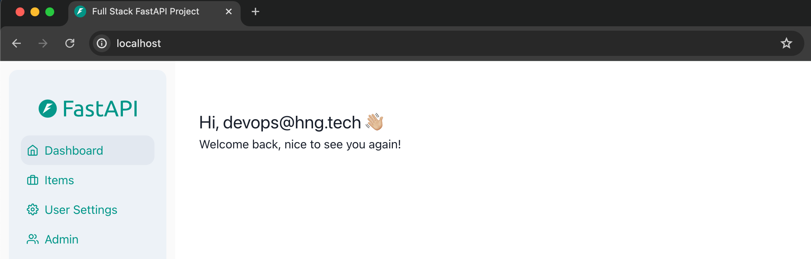

# Full-Stack FastAPI and React Application Deployment

Welcome to the Full-Stack FastAPI and React template repository. This repository serves as a demo application for interns, showcasing how to set up and run a full-stack application with a FastAPI backend and a ReactJS frontend using ChakraUI.

## Project Structure

The repository is organized into two main directories:

- **frontend**: Contains the ReactJS application.
- **backend**: Contains the FastAPI application and PostgreSQL database integration.

Each directory has its own README file with detailed instructions specific to that part of the application.

## Overview


## Getting Started

To get started with this template, please follow the instructions in the respective directories:

- [Frontend README](./frontend/README.md)
- [Backend README](./backend/README.md)


## Implementation of the Dockerized Full Stack Web Application Deployment

After completing the steps above, the following steps are taken to dockerize the application:

### Step 1: Build a Frontend Image in the `frontend` Directory

- Write a Dockerfile that contains all the **Node** dependencies and executables needed to install and run the **React** frontend.

### Step 2: Build a Backend Image in the `backend` Directory

- Write a Dockerfile that contains all the **Python Poetry** dependencies and executables needed run the **FastAPI** backend.

- Make the necessary changes in the `.env` files which will be referenced by `docker-compose` to build the application.

### Step 3: Create and Configure the `docker-compose.yml` file

The following steps are taken to configure the `docker-compose.yml` file:

- Reference the ockerfiles created in the `backend` and `frontend `directories to run as containers for the **backend** and **frontend** services respectively.

- Configure the **PostgresSQL** database as a container and ensure it is properly connected to the `backend` service.

- Configure **Traefik** as a container which serves the following:
    1. The frontend and backend on the same host machine `port 80`.
    2. The frontend on the root `/`.
    3. Proxy `/api` on the backend to `/api` on the main domain.
    4. Proxy `/docs` on the backend to `/docs` on the main domain.
    5. Proxy `/api` on the backend to `/api` on the main domain.

- **Trafik** as runs as the Proxy Manager and is accessible via the subdomain `proxy.domain`.

- Configure **Adminer** to run on `port 8080`, ensure it is accessible via the subdomain `db.domain` and properly connected to the **PostgresSQL** database.

### Step 4: Build and Run the Containerized Application

- Run the following command to build and the run the application:

```sh
docker-compose build --no-cache
docker-compose up -d
```

### Step 5: Verifying the Application

After a successful run, go to your web browser and paste the following urls:

```sh
localhost
```



```sh
db.localhost
```


```sh
proxy.localhost
```


–**Note**: The login details can be found in the `.env` file in the `backend` directory.–
